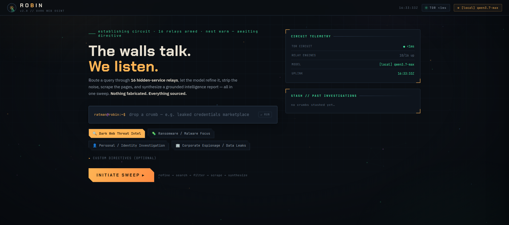

<div align="center">
   
   <h1>Robin — Enhanced Edition</h1>
   <p><strong>AI-powered dark-web OSINT</strong>, with a production-grade operations console,<br>
   multi-model support, a hardened streaming pipeline, and an always-grounded synthesis voice.</p>
   <p>
     <a href="#the-console-ui">Console UI</a> &bull;
     <a href="#quick-start">Quick Start</a> &bull;
     <a href="#configuration--llm-providers">Configuration</a> &bull;
     <a href="#architecture">Architecture</a> &bull;
     <a href="#upstream--credit">Upstream</a>
   </p>
</div>

> **A maintained fork of [`apurvsinghgautam/robin`](https://github.com/apurvsinghgautam/robin).**
> All credit for the original Robin — its search, scrape, and LLM workflow — goes to
> [Apurv Singh Gautam](https://github.com/apurvsinghgautam) and the upstream contributors.
> This edition keeps that engine **byte-for-byte intact** and layers a new front-end,
> pipeline hardening, and a tuned synthesis prompt on top. The original Streamlit UI is
> preserved unchanged and still runs exactly as upstream intended.



---

## What's different in this fork

| Capability | Upstream | This fork |
|---|---|---|
| Web UI | Streamlit only | Streamlit **plus** a self-contained FastAPI + HTML/CSS/JS **operations console** |
| Pipeline robustness | Blocking calls, no ceiling | Per-stage **timeouts**, a **heartbeat** stream, and a `stage.log` breadcrumb trail — a stalled provider or Tor circuit errors out cleanly instead of spinning forever |
| LLM choice | Built-in providers + custom | Same, plus **runtime model/provider switching** with live connection tests |
| Synthesis voice | Neutral | Tunable **identity preamble** that keeps the model grounded *and* unsoftened on grey-area content |
| Investigations | Save / load | Save / load **+** grounded follow-up chat **+** one-click pivots (carried from upstream v2.8) |
| Headless use | — | A terminal **CLI runner** with the same backend |

Everything below the front-end — `search.py`, `scrape.py`, `llm.py`, `health.py`,
`llm_utils.py`, `config.py` — is the upstream engine. The new code wraps it; it does not
rewrite it.

---

## The console UI

A dark-web *relay operations* console, served at `http://localhost:8000`:

- **Command console** — a terminal-style query prompt with four research-domain chips and an
  optional *Custom Directives* field to steer the synthesis.
- **Circuit telemetry** — live Tor latency, reachable search-engine count, active model, and a
  ticking uplink clock.
- **Pipeline stage rail** — `LOAD → REFINE → SEARCH → FILTER → SCRAPE → SYNTH`, lighting
  node-by-node with live result counts and an elapsed timer per stage.
- **Relay log** — a streaming, timestamped narration of every stage (including "still alive"
  heartbeats during long Tor searches, so a slow run never *looks* frozen).
- **Findings panel** — the report streams token-by-token, rendered as full Markdown (tables,
  code, block-quotes, cited artifacts), with collapsible Notes and Sources.
- **Follow-up chat** — ask grounded questions answered *only* from that investigation's data.
- **Suggested pivots** — one-click follow-up queries derived from the findings.
- **Settings drawer** — pick the model, configure any OpenAI-compatible provider, tune
  scraping threads / result caps, see provider status, and run live LLM / Tor / engine health
  checks.
- **Stash** — every completed investigation auto-saves and can be reloaded from the sidebar.

The aesthetic is deliberate: layered grid + drifting relay-node canvas, a radar logomark,
chamfered "cut-corner" geometry, and a five-purpose palette (amber / robin-red / terminal-green
/ ice-blue / magenta) — built to read like an ops console, not a dashboard template.

---

## Architecture


```
   query
     │
     ▼
  REFINE   (LLM)            ──► search-engine-ready keywords (≤5 words)
     │
     ▼
  SEARCH   (Tor → 16 .onion engines, concurrent)
     │
     ▼
  FILTER   (LLM)            ──► top-N relevant results
     │
     ▼
  SCRAPE   (Tor → hidden pages, size-capped)
     │
     ▼
  SYNTH    (LLM, streamed)  ──► grounded Markdown report + artifacts
     │
     ├─► PIVOTS  (LLM)      ──► next-step search queries
     └─► CHAT    (LLM)      ──► grounded follow-ups over the scraped data
```

Every stage is wrapped in a hard timeout and emits Server-Sent-Events to the console, so the UI
reflects progress in real time and a hung socket surfaces as a clear, stage-labelled error.

---

## Quick Start

### Prerequisites

- **Python 3.10+**
- **Tor** running in the background (hard dependency — searches route through `127.0.0.1:9050`)
  - Linux / WSL: `sudo apt install tor && sudo systemctl start tor`
  - macOS: `brew install tor && brew services start tor`
  - Verify: `curl --socks5-hostname 127.0.0.1:9050 https://check.torproject.org`
- At least one LLM provider (an API key, **or** any OpenAI-compatible endpoint — see below)

### Install

```bash
git clone https://github.com/<you>/robin.git
cd robin
python -m venv .venv
source .venv/bin/activate          # Windows: .venv\Scripts\activate
pip install -r requirements.txt
```

### Configure

Copy the sample environment file and add at least one provider:

```bash
cp .env.example .env
# edit .env — or skip it entirely and use the console's Custom API Provider (below)
```

### Run

**Console UI (this fork — recommended):**

```bash
python -m uvicorn app:app --host 127.0.0.1 --port 8000
# or simply:  python app.py
```

Then open **http://localhost:8000**.

**Original Streamlit UI (unchanged upstream):**

```bash
streamlit run ui.py
```

Then open **http://localhost:8501**.

**Terminal / headless:**

```bash
python cli.py "your dark-web query"
python cli.py --preset ransomware_malware "lockbit affiliate handles"
python cli.py --interactive          # REPL — drop one query at a time
```

> **First start is slow.** The LLM stack (LangChain + provider SDKs) imports a large number of
> modules, so the server takes ~30–60 s to come up — longer on network/WSL-mounted filesystems.
> This is import latency, not a fault; the console's relay log ticks once it's live.

---

## Configuration & LLM providers

### Built-in providers

Set the relevant key in `.env` (or your shell) and the model appears in the selector:
`OPENAI_API_KEY`, `ANTHROPIC_API_KEY`, `GOOGLE_API_KEY`, `OPENROUTER_API_KEY`, plus local
`OLLAMA_BASE_URL` / `LLAMA_CPP_BASE_URL`.

### Any OpenAI-compatible provider (no `.env` edit required)

This is the most flexible path and the one this fork is optimised for. In the console's
**Settings** drawer (or the Streamlit sidebar's *Custom API Provider* expander), enter:

- **Base URL** — e.g. `https://your-gateway.example.com/v1`
- **API key** — optional (some gateways don't require one)
- **Model name** — required if the provider doesn't expose `/v1/models` for auto-discovery

The provider is applied at runtime and persisted to `.env` on save. The same fields map to
`CUSTOM_API_BASE_URL`, `CUSTOM_API_KEY`, and `CUSTOM_API_MODEL` if you prefer editing the file.

> **Choosing a backend.** Robin's synthesis quality — and how completely it surfaces grey-area
> findings — depends on the provider's alignment posture. Thin-alignment, OpenAI-compatible
> endpoints (self-hosted open-weights via `vllm`/`llama.cpp`, or permissive cloud gateways) give
> the most complete results for sensitive investigations. Leaving the key field blank keeps the
> existing configured key — saving never wipes a working provider.

### Health checks

The Settings drawer (and the Streamlit sidebar) can test the live LLM connection, the Tor
circuit, and ping all 16 search engines — useful for confirming the wire before a sweep.

---

## Research domains (presets)

Each preset swaps the synthesis prompt to prioritise different artifacts:

- 🔍 **Dark Web Threat Intel** — general IOCs, actor handles, markets, TTPs
- 🦠 **Ransomware / Malware Focus** — families, C2, hashes, MITRE mapping
- 👤 **Personal / Identity Investigation** — exposed PII, breach sources, exposure risk
- 🏢 **Corporate Espionage / Data Leaks** — leaked credentials, source, internal data, impact

**Custom Directives** (optional) lets you add a steering line on top of any preset — e.g.
*"prioritise anything with a price, a wallet address, a vendor handle, or a payment method; flag
recency."* Use it to pre-sort the report toward whatever you're actually hunting.

---

## Investigations & follow-ups

Every completed sweep auto-saves to `investigations/` as JSON and can be reloaded from the
sidebar. A loaded or completed investigation exposes:

- the full findings report (downloadable as Markdown),
- the cited source list,
- a **grounded follow-up chat** — answered strictly from that investigation's scraped data, and
- **one-click pivots** — derived follow-up queries that launch a fresh sweep.

The `investigations/` directory is local-only and git-ignored.

---

## The synthesis voice (ratman preamble)

This fork injects an *identity preamble* into every internal LLM call (`RATMAN_PREAMBLE` in
`llm.py`). It does two things at once:

1. keeps the synthesis model **grounded** — it reports only artifacts present in the scraped
   data, and says so plainly when the data is thin, and
2. keeps it **unsoftened** — it surfaces everything it finds (handles, markets, prices,
   addresses, illicit content) without hedging, moralising, or omitting categories.

The preamble is voice + intent, *not* a format override — each preset still controls the output
structure. It is defined in one place and is easy to tune or remove entirely if you prefer the
upstream's neutral voice; the grounding rule is worth keeping either way.

> The preamble shapes tone and intent. It cannot remove a provider's own weights-level
> refusals — that is a property of the model you route to, which is exactly why the
> custom-provider path above exists.

---

## Docker

The upstream Docker image remains the cleanest isolated path for the **Streamlit** UI:

```bash
docker run --rm \
   -v "$(pwd)/.env:/app/.env" \
   -v "$(pwd)/investigations:/app/investigations" \
   --add-host=host.docker.internal:host-gateway \
   -p 8501:8501 \
   apurvsg/robin:latest
```

For the **console UI**, run `app.py` inside any Python 3.10+ image with Tor reachable on the
host (mount `.env` and `investigations/` as above and expose port `8000`).

---

## Project layout

```
app.py            # FastAPI console backend (SSE streaming) — this fork
static/index.html # self-contained console UI (inline CSS/JS) — this fork
cli.py            # terminal runner — this fork
ui.py             # original Streamlit UI (unchanged upstream)
search.py         # 16 dark-web search engines over Tor (upstream)
scrape.py         # concurrent .onion scraper (upstream)
llm.py            # refine / filter / summarize / follow-up / pivots (+ preamble)
llm_utils.py      # model registry + streaming handler (upstream)
health.py         # Tor / LLM / engine health checks (upstream)
config.py         # .env loader (upstream)
```

---

## Upstream & credit

This project is a fork of **[Robin](https://github.com/apurvsinghgautam/robin)** by
[Apurv Singh Gautam](https://github.com/apurvsinghgautam), inspired by Thomas Roccia's
*Perplexity of the Dark Web* concept. The enhanced console, pipeline hardening, CLI, and prompt
layer in this edition are the fork's additions; the search/scrape/LLM engine is upstream's work
and is preserved intact. Logo design by [Tanishq Rupaal](https://github.com/Tanq16).

Please direct upstream-feature bug reports to the original repository; fork-specific issues
(the console, the CLI, the preamble) belong here.

---

## ⚠️ Disclaimer

> This tool is intended for **lawful OSINT, research, and defensive investigation**. Accessing or
> interacting with certain dark-web content may be illegal depending on your jurisdiction. The
> authors are not responsible for any misuse of this tool or the data gathered with it.
>
> Robin is a **read-only scout**: it searches and reads publicly posted hidden-service content;
> it does not log in to, post on, or transact with markets or forums. Treat every scraped page as
> untrusted evidence, keep your Tor circuit isolated from any authenticated browsing, and comply
> with all applicable laws and the terms of service of any LLM provider you configure.
>
> Use responsibly and at your own risk.

---

## License

MIT — matching the upstream project. See [LICENSE](LICENSE).
